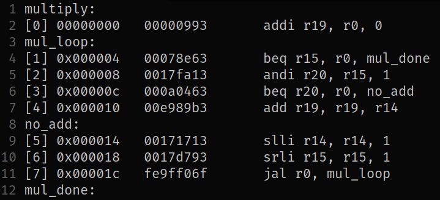

# 3. Project Architecture

This chapter provides a high-level overview of the simulator architecture. It introduces the major software components, explains how they interact, presents the overall execution flow of the simulator, and describes the primary data structures used throughout the project. Detailed implementation of each subsystem is covered in the corresponding chapters.

---

# 3.1 Overall Architecture

<!-- Overall Architecture Diagram -->
[](assets/figures/overall_structure.svg)
> Figure 3.1: Overall simulator architecture.

The simulator consists of three major phases:

- Program preparation
    - Assembler
    - Loader
- Simulation
    - CPU
    - Cache hierarchy
    - Main memory
- Analysis
    - Statistics generation
    - Visualization

The assembler converts RV32I assembly programs into a custom object format understood by the simulator. The Assembler also resolves all function calls assuming that the code resides at address 0 (See **Chapter X - Assembler** for more details).
The loader initializes the simulator memory using the generated object file. During simulation, the CPU executes instructions while interacting with the cache hierarchy and main memory.
Finally, execution statistics are collected and may be visualized using the provided analysis scripts.

---

# 3.2 Major Components

This section briefly introduces each subsystem of the project. Detailed implementation is discussed in later chapters.

---

## 3.2.1 Assembler

The assembler translates RV32I assembly source code into the simulator's custom object format.

Responsibilities:

- Lexical analysis
- Instruction parsing
- Label resolution
- Immediate encoding
- Object file generation

<!-- Screenshot -->
[](assets/screenshots/example_object_file.png)

See **Chapter X – Assembler** for implementation details.

---

## 3.2.2 CPU

The CPU models a five-stage in-order RV32I pipeline.

Implemented stages include:

- Instruction Fetch (IF)
- Instruction Decode (ID)
- Execute (EX)
- Memory Access (MEM)
- Write Back (WB)

The processor supports the complete **RV32I** base integer instruction set.

See **Chapter X – Pipeline**.

---

## 3.2.3 Main Memory

Main memory stores both program instructions and program data.

Features:

- Configurable memory size
- Byte-addressable memory organization
- Little-endian storage
- Separate code (read only) and data (read and write) regions

See **Chapter X – Memory System**.

---

## 3.2.4 Cache Hierarchy

The cache subsystem models realistic memory access latency.

Responsibilities:

- Cache lookup
- Hit/miss detection
- Replacement policy execution
- Write policy handling
- Stall generation

Features:

- Up to three configurable cache levels
- Configurable cache parameters
- Multiple replacement policies
- Configurable write policies

See **Chapter X – Cache Hierarchy** and **Chapter X – Configuration**.

---

## 3.2.5 Visualization Module

The visualization module processes simulator output to generate graphical representations of execution behaviour.

Example analyses include:

- Cache statistics
- CPI analysis
- Memory access heatmaps
- Memory access distributions
- Pipeline statistics

The visualization scripts aid in understanding program behaviour under different system configurations.

See **Chapter X – Performance Statistics**.

---

# 3.3 Simulator Execution Flow

This section describes the overall flow of control during simulation.

Unlike the processor pipeline, this figure represents the execution order of the simulator software during each simulation cycle.

<!-- Execution Flow Diagram -->
[](assets/figures/code_execution_flow.svg)
> Figure 3.2: Code Execution Flow

- Simulator initializes all components.
- Each simulation cycle executes the pipeline stages in reverse order (WB → MEM → EX → ID → IF).
- Memory operations invoke the cache subsystem to determine access latency and update cache state.
- Cache misses introduce pipeline stalls before simulation resumes.
- Simulation terminates once the program completes execution.

---

# 3.4 Project Directory Structure

This section presents the organization of the project source tree.

<!-- Directory Structure Diagram -->
[](assets/figures/directory_structure.svg)

Each directory contains a logically independent subsystem to improve modularity and maintainability.

---

# 3.5 Important Data Structures

This section introduces the primary data structures used throughout the simulator.

Implementation details are presented in the corresponding chapters.

---

## 3.5.1 CPU State

- Register File
- Program Counter (PC)
- Instruction Register (IR)

Why are these represented as `uint32_t`?

Reference:
**Section 3.6 – Design Decisions**

---

## 3.5.2 Control Signal Structures

Each of the following structures are generated during decode stage and contain all the control signals consumed by a particular stage.
- `ex_control`
- `ma_control`
- `wb_control`

See **Chapter X - CPU Architecture** for more details.

Explain why the control signals are grouped into independent structures instead of individual variables.

Reference:
**Section 3.6 – Design Decisions**

---

## 3.5.3 Main Memory

The main memory is represented as an array of unsigned 8 bit integers or bytes.
```c
uint8_t * dram;
```

Why is memory represented as an array of bytes?
Why is the dram dynamically allocated ?

Reference:
**Section 3.6 – Design Decisions**

---

## 3.5.4 Cache Data Structures

```c
typedef struct cache_line{
	uint32_t data;
	uint32_t addr;
	uint8_t valid;
	uint8_t dirty;
	uint8_t done;
	uint64_t reference;
} cache_line;
```

Every cache is an array of struct cache_line. The structure includes address field, and book keeping bits. Each structure represents a word length data that is 4 bytes.
The cache is accessed according to the cache configuration settings.
For example if a block is 16 bytes, then the block consists of 4 cache_line structs. The book keeping bits for the block are held in all the 4 structs, meaning, to set the block dirty all the four dirty bits are set.

See **Chapter X - Cache Hierarchy** for more details.

---

```c
typedef struct cache_level{
	int level;
	cache_line * cache;
	int write_latency;
	int read_latency;
	int cache_size;
	int block_size;
	int associativity;
	int write_policy;
	int write_miss_policy;
	int replacement_policy;
} cache_level;
```
Every cache level is described by a struct cache_level. It contains all the configurable attributes for a particular cache level and a pointer to the actual dynamically allocated array of cache_line structs.

See **Chapter X - Cache Hierarchy** for more details.

Why are the caches dynamically allocated ?

Reference:
**Section 3.6 – Design Decisions**
---

## 3.5.5 Pipeline Registers

There are 5 pipeline registers. The register WB/IF is only for pipelive visualization purposes and has not computation purpose whatsoever.

- IF/ID
- ID/EX
- EX/MA
- MA/WB
- WB/IF

The actual struct definitions are explained in the **Chapter X - Pipeline**.

Discuss:

- Why pipeline registers are represented using structures.
- Why the WB/IF register exists.
- How this design supports forwarding and hazard detection.

Reference:
**Section 3.6 – Design Decisions**

---

# 3.6 Design Decisions

Are you sure about this ?

This section discusses the reasoning behind the major architectural and implementation decisions made during development.

Topics include:

- Choice of programming language
- Representation of processor state
- Memory organization
- Cache representation
- Pipeline register design
- Control signal organization
- Reverse-order pipeline execution
- Modular project organization
- Design trade-offs

(Implementation later.)
