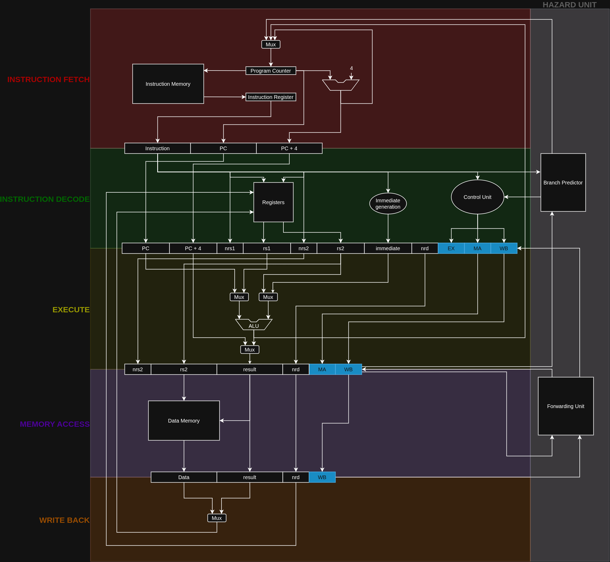

# 7. Pipeline

This chapter describes the five-stage pipeline implemented by the simulator. It explains how instructions progress through the processor, how state is transferred between stages using pipeline registers, how control information is propagated, and how the pipeline handles stalls and flushes. Detailed discussions of hazard detection, forwarding, and branch prediction are deferred to Chapters 8 and 9.

---

# 7.1 Introduction

## 7.1.1 Motivation

Instruction pipelining improves processor throughput by allowing multiple instructions to execute simultaneously in different stages of the processor. Rather than waiting for one instruction to complete before beginning the next, execution is divided into a sequence of stages, each responsible for a small portion of the instruction lifecycle.

In an ideal pipeline, one instruction completes every clock cycle after the initial pipeline fill.

---

## 7.1.2 Five-Stage Pipeline

The processor implements the classical five-stage RISC pipeline.

| Stage | Description |
|--------|-------------|
| IF | Instruction Fetch |
| ID | Instruction Decode and Register Read |
| EX | Execute / Address Calculation |
| MEM | Data Memory Access |
| WB | Register Write Back |

### Complete Pipeline Datapath

[](assets/figures/pipeline_datapath.png)

> Figure 7.1 — Five-stage pipeline overview

---

## 7.1.3 Pipeline Execution

Briefly explain:

- Pipeline fill
- Steady-state execution
- Pipeline drain
- Ideal CPI
- Multiple instructions executing simultaneously

---

# 7.2 Pipeline Overview

This section introduces the complete processor datapath.

Insert the **complete CPU datapath diagram** here.

**Figure 7.2 — Complete processor datapath**

The datapath consists of

- Program Counter
- Instruction Memory
- Register File
- Immediate Generator
- ALU
- Data Memory / Cache Interface
- Pipeline Registers
- Control Unit
- Hazard Detection Unit
- Forwarding Unit

Briefly describe the responsibility of each block.

Provide links to:

- CPU Architecture
- Hazard Handling
- Branch Prediction
- Cache Hierarchy

---

# 7.3 Pipeline Registers and Control Propagation

---

## 7.3.1 Pipeline Registers

Explain why pipeline registers exist.

Discuss

- isolation between stages
- state preservation
- simultaneous execution

---

### IF/ID Register

Insert cropped datapath showing IF and IF/ID only.

Include actual C structure.

Explain every field.

---

### ID/EX Register

Insert cropped datapath.

Include actual structure.

Explain

- operands
- immediate
- destination register
- decoded instruction
- control signals

---

### EX/MEM Register

Insert cropped datapath.

Include structure.

Explain stored ALU result and memory information.

---

### MEM/WB Register

Insert cropped datapath.

Include structure.

Explain writeback information.

---

## 7.3.2 Control Signal Propagation

Insert cropped datapath highlighting only control path.

Explain:

The Control Unit generates all control signals during the Decode stage.

These signals are stored inside the pipeline registers and propagated alongside instruction data until they are consumed by later stages.

Describe every propagated control signal.

Example table:

| Signal | Generated | Used | Purpose |
|---------|-----------|------|---------|
| RegWrite | ID | WB | Enable register write |
| MemRead | ID | MEM | Perform memory read |
| MemWrite | ID | MEM | Perform memory write |
| MemToReg | ID | WB | Select memory data |
| Branch | ID | EX | Branch evaluation |
| ALUSrc | ID | EX | ALU operand selection |
| ALUOp | ID | EX | ALU operation |

Explain that detailed behavior of each signal will be covered in the respective stage sections.

---

## 7.3.3 Stalls

Explain pipeline stalls at a high level.

Describe

- preventing pipeline register updates
- freezing earlier stages
- inserting bubbles

Mention:

Detailed hazard conditions are explained in Chapter 8.

---

## 7.3.4 Flushes

Explain

- incorrect speculative instructions
- converting instructions into NOPs
- pipeline recovery after branch resolution

Mention that branch prediction is explained later.

---

# 7.4 Instruction Fetch (IF)

Insert cropped datapath showing only IF stage.

Explain

## Components

- Program Counter
- PC Incrementer
- Next-PC MUX
- Instruction Cache
- IF/ID Register

---

## Inputs

Describe every input.

---

## Outputs

Describe every output.

---

## Operations

Explain

- instruction fetch
- PC increment
- branch target selection

---

## Control Signals

Explain

- PCWrite
- IFFlush
- Stall

---

## Pipeline Register Update

Explain what is written into IF/ID.

---

# 7.5 Instruction Decode (ID)

Insert cropped datapath.

Explain

## Components

- Register File
- Immediate Generator
- Control Unit
- Hazard Detection Unit

---

## Register Read

Explain dual-port register file.

---

## Immediate Generation

Reference ISA chapter.

---

## Instruction Decode

Explain opcode decoding.

---

## Control Signal Generation

Explain every generated control signal.

---

## Hazard Detection

Only briefly explain.

Reference Chapter 8.

---

## Pipeline Register Update

Explain ID/EX contents.

---

# 7.6 Execute (EX)

Insert cropped datapath.

Explain

## Components

- ALU
- Operand Multiplexers
- Branch Comparator
- Branch Target Adder
- Forwarding Unit

---

## ALU Operations

Explain supported operations.

---

## Branch Evaluation

Explain

- comparison
- target calculation

---

## Forwarding Inputs

Brief overview.

Reference Chapter 8.

---

## Control Signals

Explain

- ALUSrc
- ALUOp
- Branch

---

## Pipeline Register Update

Explain EX/MEM contents.

---

# 7.7 Memory Access (MEM)

Insert cropped datapath.

Explain

## Components

- Data Cache
- Memory Interface

---

## Memory Read

---

## Memory Write

---

## Cache Interface

Reference Chapter 10.

---

## Control Signals

Explain

- MemRead
- MemWrite

---

## Pipeline Register Update

Explain MEM/WB contents.

---

# 7.8 Write Back (WB)

Insert cropped datapath.

Explain

## Components

- Writeback MUX
- Register File

---

## Result Selection

Explain

- ALU result
- Load result

---

## Register Update

Explain writeback timing.

---

## Control Signals

Explain

- RegWrite
- MemToReg

---

# 7.9 Pipeline Operation Summary

Summarize

- stage responsibilities
- data flow
- control flow
- pipeline register interaction

---

# 7.10 Example Execution — ADD Instruction

Example:

```assembly
add x5, x6, x7
```

Cycle-by-cycle walkthrough.

Describe

Cycle 1

- IF

Cycle 2

- ID

Cycle 3

- EX

Cycle 4

- MEM

Cycle 5

- WB

Explain

- values read
- ALU operation
- propagated control signals
- pipeline register contents

Include pipeline timing diagram.

---

# 7.11 Example Execution — Store Word

Example

```assembly
sw x5, 12(x6)
```

Explain

- address calculation
- memory write
- control signals
- no writeback stage

Show pipeline timing.

---

# 7.12 Example Execution — Branch Instruction

Example

```assembly
beq x5, x6, target
```

Explain

- comparison
- target calculation
- prediction
- branch resolution
- flush generation
- PC update

Show cycle-by-cycle execution.

Reference Branch Prediction chapter.

---

# 7.13 Multiple Instructions in Flight

Insert pipeline timing chart.

Example

| Cycle | 1 | 2 | 3 | 4 | 5 | 6 | 7 |
|-------|---|---|---|---|---|---|---|
| I1 | IF | ID | EX | MEM | WB | | |
| I2 | | IF | ID | EX | MEM | WB | |
| I3 | | | IF | ID | EX | MEM | WB |
| I4 | | | | IF | ID | EX | MEM |

Explain

- overlapping execution
- instruction throughput
- pipeline occupancy

Discuss how

- stalls pause instruction movement
- flushes remove incorrect instructions
- forwarding allows dependent instructions to continue
- hazards reduce ideal throughput

Conclude with a transition into Chapter 8 (Hazard Handling), where these mechanisms are described in detail.
